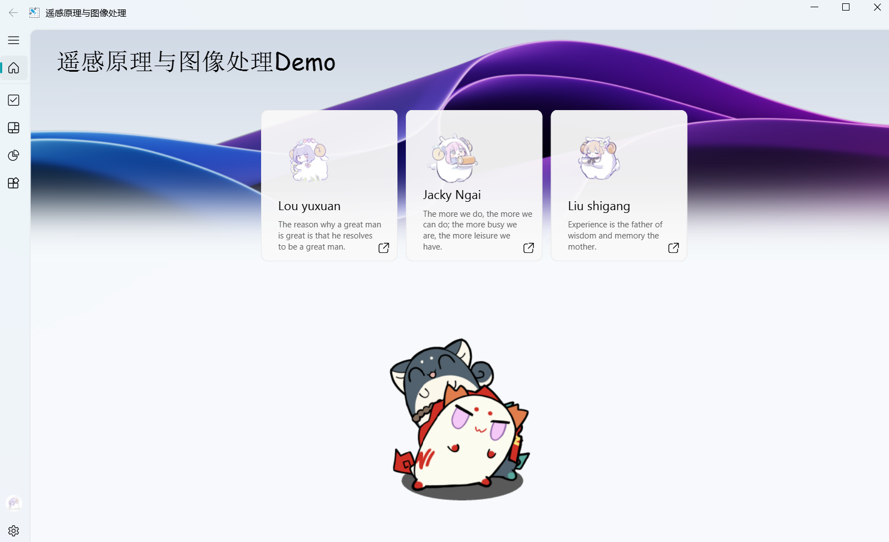
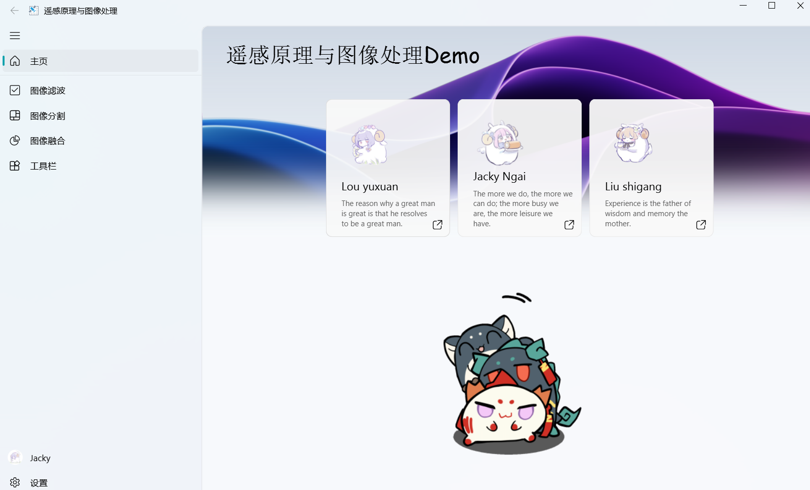
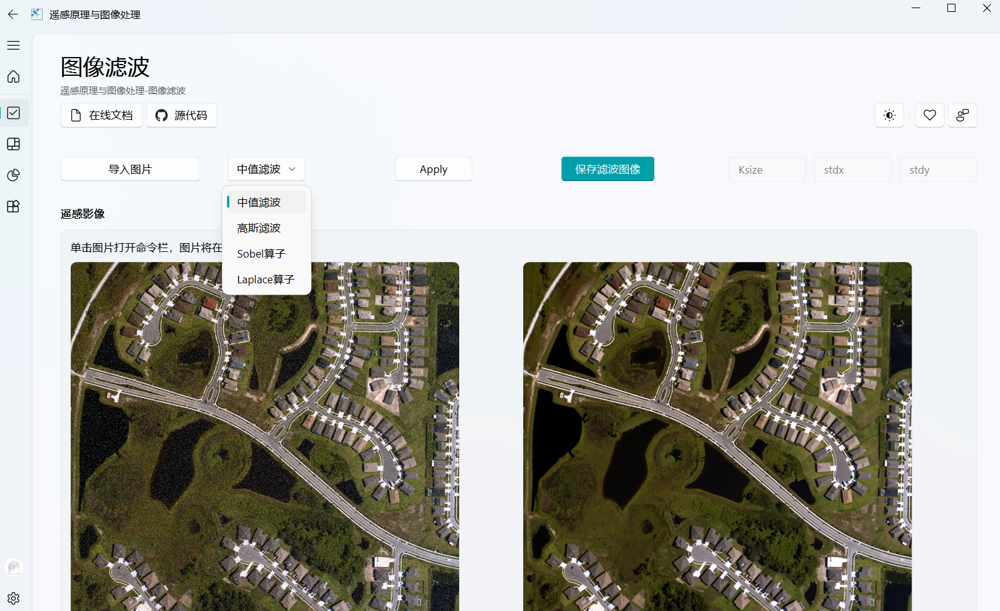
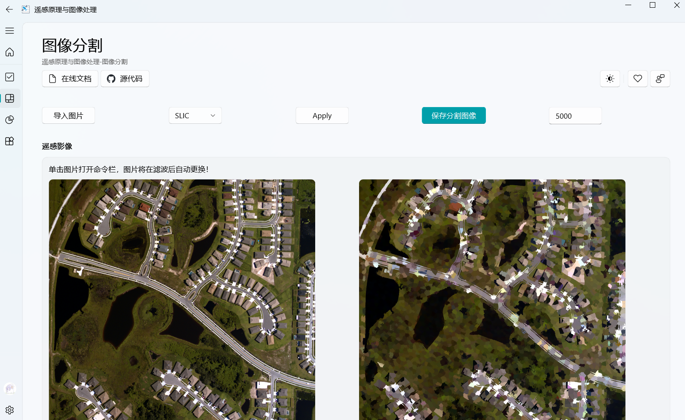
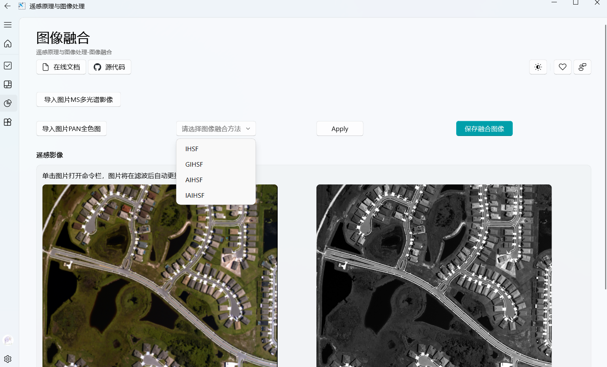
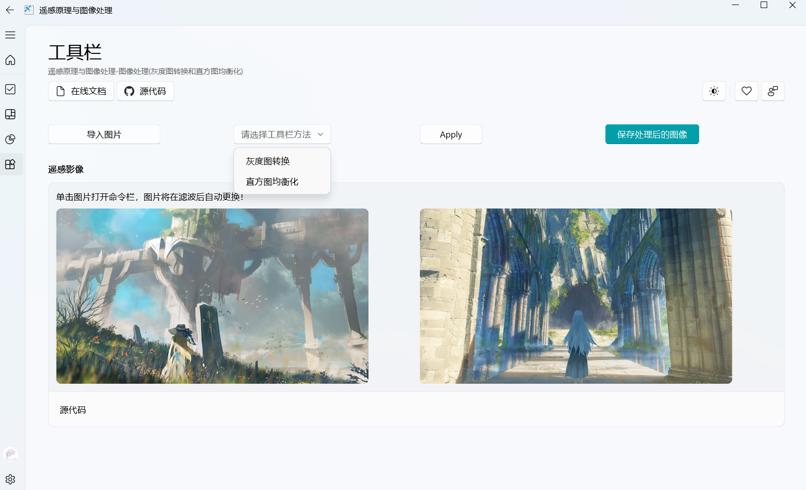

# Remote sensing UI software

本项目为深圳大学遥感原理与图像处理期末作业。

libGD为我们小组用C++自行编写并编译成Python的自定义库，UI设计部分我们采用Python-Fluent框架进行创作。

本次实验我们实现了遥感图像处理的大部分基础功能，包括：图像滤波（中值滤波、高斯滤波、Sobel算子、Laplace算子），图像分割（SLIC），图像融合（IHSF, GIHSF, AIHSF, IAIHSF），以及提供了灰度图转换和直方图均衡化。

## 环境配置

### Python Pyqt5-Fluent库安装

```cmd
pip install Pyqt5
pip install "PyQt-Fluent-Widgets[full]"
pip install PyQt5-tools
```

### Opencv库安装

```cmd
pip install opencv-python
```

## 运行程序

安装完上面两项就完成啦！接着就可以用python运行**Project_demo.py**文件。

## UI界面



### 功能预览



### 图像滤波

图像滤波（中值滤波、高斯滤波、Sobel算子、Laplace算子）



### 图像分割

图像分割SLIC



### 图像融合

图像融合（IHSF、GIHSF、AIHSF、IAIHSF）



### 工具栏

灰度图转换、直方图均衡化

